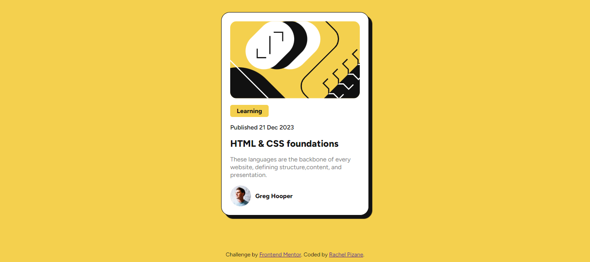

# Blog preview card solution | Frontend Mentor

This is a solution to the [Blog preview card challenge on Frontend Mentor](https://www.frontendmentor.io/challenges/blog-preview-card-ckPaj01IcS).

## Overview 🌎

### Screenshot

### Links

- Live Site URL: [GitHub Page - Blog preview card](https://rachelpizane.github.io/FM02-Blog-Preview-Card/)

## My process 🗺️

### Built with

- Semantic HTML5 markup
- CSS custom properties

### What I learned

When doing this challenge I analyzed when I should or should not use a container. Because sometimes I wonder which elements would be easier to work with if they were combined into one.

Furthermore, there are times when I get lost with the names I give to the classes. I'm studying how to name them properly.